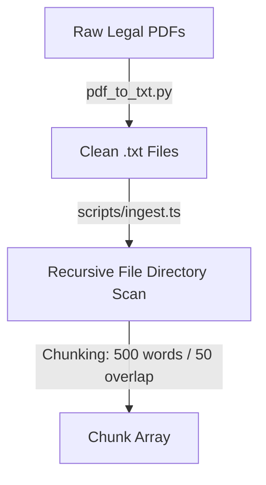
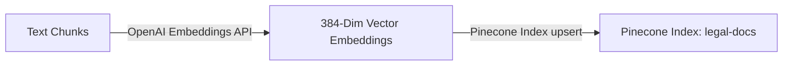
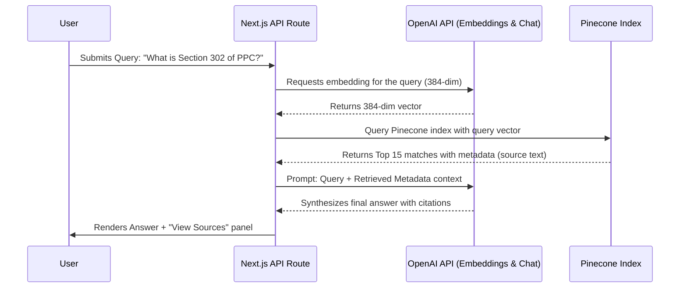

# PakLaw AI — Technical Architecture & Ingestion Guide

This document serves as the comprehensive technical guide and architectural overview of **PakLaw AI**, a Retrieval-Augmented Generation (RAG) chatbot designed to ingest and answer questions about Pakistani laws using over 1,000 legal source documents.

---

## 1. Technical Stack Overview

The application is built using a modern, scalable AI stack:
*   **Frontend & Backend**: Next.js 16 (App Router) using React, TypeScript, and TailwindCSS, optimized for fast rendering and API handling.
*   **Vector Database**: Pinecone (Serverless) for storing and performing high-speed semantic search over vector embeddings.
*   **Embeddings**: OpenAI `text-embedding-3-small` (configured to **384 dimensions** to balance retrieval performance, latency, and cost-efficiency).
*   **Language Model**: OpenAI API (`gpt-4o` or similar chat model) for synthesizing retrieve-context answers.
*   **Data Preprocessing**: Python (`pdf_to_txt.py`) for extracting and cleaning text data from raw legal PDFs.
*   **Ingestion Engine**: TypeScript-based CLI runner (`scripts/ingest.ts`) running on Node.js using `tsx`.

---

## 2. System Architecture & Flow

### A. Data Preprocessing & Preparation


1.  **PDF Conversion**: Raw PDFs are parsed using a Python script, extracting the plain text and maintaining page and formatting markers wherever possible. Clean `.txt` files are written into the `data/` directory.
2.  **Chunking Strategy**: Documents are loaded recursively and split into text chunks of **500 words** with an overlap of **50 words** to prevent context loss at chunk boundaries. Empty or whitespace-only chunks are automatically discarded.

### B. Vector Ingestion Pipeline


1.  **Batch Processing**: To avoid hitting OpenAI API rate limits and optimize speed, chunks are batched in groups of **50**.
2.  **Embedding Generation**: The script calls the OpenAI Embeddings API with `text-embedding-3-small` and specifies `dimensions: 384`.
3.  **Pinecone Ingestion**: The generated vectors are uploaded to the Pinecone index `legal-docs`. Each record includes:
    *   `id`: `${filename}-chunk-${index}`
    *   `values`: 384-dimensional vector
    *   `metadata`: Contains the `text`, `filename`, and `chunk_index` for RAG context construction.

### C. Query Flow (RAG Chatbot)


---

## 3. Major Blockers & Resolutions

During the implementation and scaling of the ingestion pipeline to over 1,000 documents, several technical hurdles were resolved:

### Blocker 1: `PineconeArgumentError` during Batch Upsert
*   **The Issue**: The ingestion script was calling `index.upsert(vectors)`. In newer versions (v3+) of the Pinecone Node.js SDK, the method signature was changed to require an options object containing a `records` property.
*   **Resolution**: Updated the call in `scripts/ingest.ts` to:
    ```typescript
    await index.upsert({ records: vectors });
    ```

### Blocker 2: Dimension Mismatch Error (`Vector dimension 1536 does not match index 384`)
*   **The Issue**: The Pinecone index `legal-docs` was configured with **384 dimensions** (customized for cost-effectiveness and performance). However, parts of the application were generating embeddings without specifying the dimension, which defaulted to OpenAI's standard **1536 dimensions**. This caused query requests to fail with a validation mismatch.
*   **Resolution**: Updated both the query generation code in the API routes (`src/app/api/chat/route.ts` / `src/lib/pinecone.ts`) and the ingestion script (`scripts/ingest.ts`) to explicitly set the dimension parameter:
    ```typescript
    const embeddings = await openai.embeddings.create({
      model: "text-embedding-3-small",
      input: batch,
      dimensions: 384, // Explicitly matched to Pinecone Index configuration
    });
    ```

### Blocker 3: Network Dropouts & Ingestion Interruption
*   **The Issue**: Processing 1,000+ legal documents requires thousands of API requests. Any minor network hiccup, socket drop, or rate-limiting error would crash the script, forcing it to restart from the beginning and wasting API cost/time.
*   **Resolution**: Implemented a robust **Checkpoint and Resumption System**:
    1.  Maintained a `.ingested_progress.txt` progress file.
    2.  Upon successfully processing and ingesting a document, its filename is written to the progress file.
    3.  When restarted, the script reads this progress file, loads files into a `Set`, and skips already-indexed files, enabling it to resume seamlessly from the exact file where it was interrupted.

### Blocker 4: Hidden/Temporary File Scanning
*   **The Issue**: Saving the `.ingested_progress.txt` file inside the `data/` folder caused the recursive scanner to index it as a legal document. Additionally, hidden files like `.DS_Store` caused errors during PDF parsing.
*   **Resolution**:
    1.  Moved the progress file to the project root directory.
    2.  Updated `getFilesRecursively` inside `scripts/ingest.ts` to ignore any files or directories starting with a dot (`.`):
        ```typescript
        list.forEach((file) => {
          if (file.startsWith('.')) return; // Exclude hidden files
          // Recurse directories or push .txt files...
        });
        ```

---

## 4. Production Deployment Checklist

When deploying this project to **Vercel** or other production platforms:

1.  **Environment Variables**:
    Ensure the following keys are populated in your hosting dashboard:
    *   `PINECONE_API_KEY`: Found in the Pinecone Console.
    *   `PINECONE_INDEX_NAME`: Should be set to `legal-docs`.
    *   `OPENAI_API_KEY`: Found in the OpenAI Developer Console.
    *   `NEXT_PUBLIC_SUPABASE_URL`: Supabase project URL.
    *   `NEXT_PUBLIC_SUPABASE_ANON_KEY`: Supabase client anonymous key.
    *   `SUPABASE_SERVICE_ROLE_KEY`: Supabase service role key (for server-side operations).
2.  **Vercel Build Command**:
    The production build command is `npm run build`. The project has been validated and compiles successfully under Next.js Turbopack with zero compiler warnings or TypeScript errors.
